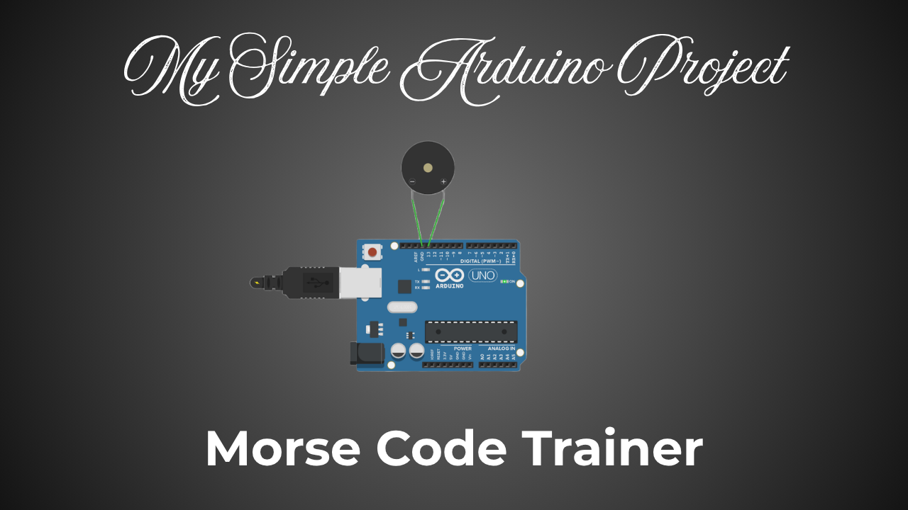
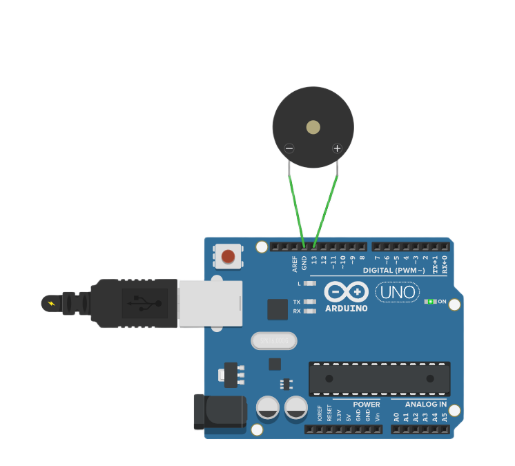

# 🔎 Morse Code Decryption Trainer
This is a simple trainer I made, so you can practice your morse code decryption skills

 

## 📦 Materials and Technologies Used
- `Arduino UNO`
- `Arduino IDE`
- `Buzzer`
- `Male to Female Jumper Wires`

 

## 🔌 Setup Guide
0. Buy Arduino UNO
1. Download Arduino IDE on your laptop
2. Connect your Arduino UNO to your laptop using USB
3. Follow the steps 4 - 7, refer diagram to help
4. Take the Male End of a Jumper Wire (the one with the long pin) and connect it to any output pin of arduino (preferrably ones without a '~')
5. Connect the Female End of that Jumper Wire to the Positive of Buzzer (Most commonly the Red Wire)
6. Take another Jumper Wire and connect the Male End to the Ground (GND) Pin of the Arduino
7. Connect the Female End to the Negative of the Buzzer (Most commonly the Black Wire)
8. Click 'New Sketch'
9. Copy the code from 'arduino_code.txt' and paste into the Arduino IDE
10. Enter the input pin in the first line after the '=' symbol (in the diagram, input pin is 13, so type 13)
11. Select the boards and ports
12. Upload code into the Arduino UNO
13. You buzzer should beep

 

## 📖 Project Guide
1. Go to the Serial Monitor (the magnifying glass, top right of the IDE)
2. It will ask you to click 'Enter'
3. Press the 'Enter' key to start
4. You buzzer should beep a random morse code
5. Once the beeping ends, the program should ask you to enter the morse code
6. If you get it right, it will say "Correct"
7. If you got it wrong, it will say "Wrong" and give you the answer so you can review
8. Then it will ask you to click 'Enter' again to start another random morse code

 

## ℹ️ Why I made this Project?
I made this project as a total beginner in arduino.. though I do have some coding skills...
I searched online for morse, which only gives tutorials...
But Morse isn't something you learn using tutorials... but something you learn using practice..
I wanted something that could help me practice...
And I looked at my arduino,
And then I put two and two together and made this project...
